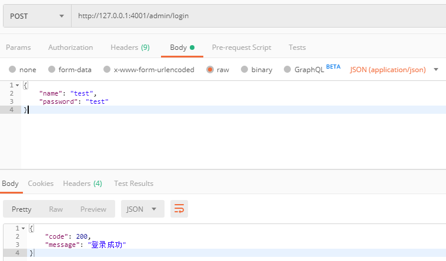

# koa_demo
koa搭建的一个后端服务器，可用于项目参考

## 项目结构

└── demo <br/>
    ├── app.js  // 单进程项目启动文件（搭建了koa服务）<br/>
    ├── clusterCtl.sh  // bash脚本，在linux下可通过执行（clusterCtrl.sh start | stop | restart）来启动 <br/>
    ├── clusterEntrance.js  // 整个项目的真正入口文件（用于启动多进程）<br/>
    ├── config  // 所有需要配置的文件（如数据库信息等）<br/>
    │   └── default.js <br/>
    ├── controllers  // 业务逻辑代码存放 <br/>
    │   ├── admin.js <br/>
    │   ├── redisTest.js <br/>
    │   └── user.js <br/>
    ├── libs  // 包括数据库的封装以及一些其他操作 <br/>
    │   ├── authutil.js  // 一些公用的方法 <br/>
    │   ├── dateutil.js <br/>
    │   ├── mongo.js  // 对mongo进行了简单的封装，根据需要可使用mongoose模块 <br/>
    │   ├── mysql.js  // 对mysql的简单连接操作（根据需求，和sequelize.js中选择一个用于项目即可）<br/>
    │   ├── redis.js  // 简单的封装了redis操作，如需拓展redis操作，在该处拓展 <br/>
    │   ├── sequelize.js  // 引入了sequelize模块，用于mysql的orm映射 <br/>
    │   └── signcheck.js  // 路由验证中间件 <br/>
    ├── log4js.json  // log4js模块的相关配置 <br/>
    ├── logs  // 日志输入 <br/>
    │   └── app-.2019-08-07.log <br/>
    ├── models  // 关于数据库的操作及如果用到orm映射时，model存放 <br/>
    │   ├── admin.js <br/>
    │   └── user.js <br/>
    ├── package.json  // 包管理文件 <br/>
    ├── package-lock.json <br/>
    ├── public  // 存放公共资源 <br/>
    │   ├── images <br/>
    │   │   └── postman.PNG <br/>
    │   └── stylesheets <br/>
    │       └── style.css <br/>
    ├── routers  // 路由文件 <br/>
    │   └── index.js <br/>
    ├── run  // 存放了主进程的进程pid，主要用于bash脚本，不必过多关注 <br/>
    └── views  // 存放静态页面 <br/>
        └── error.pug <br/>

### 项目运行思路： clusteEntrance.js | app.js => routers/index.js => controllers/... => models/...

## 让代码运行
```
// 进入demo文件夹下
cd ./demo

// 安装依赖包
npm install --save

// 运行项目
方法一：启动单一进程
node app.js

方法二：启动多进程
node clusterEntrance.js

方法三：在linux下启动项目
clusterCtl.sh start

// 前端调用接口(可用postman进行接口调用测试)
request(http://127.0.0.1:4001/admin/login)
```

## postman请求图示

